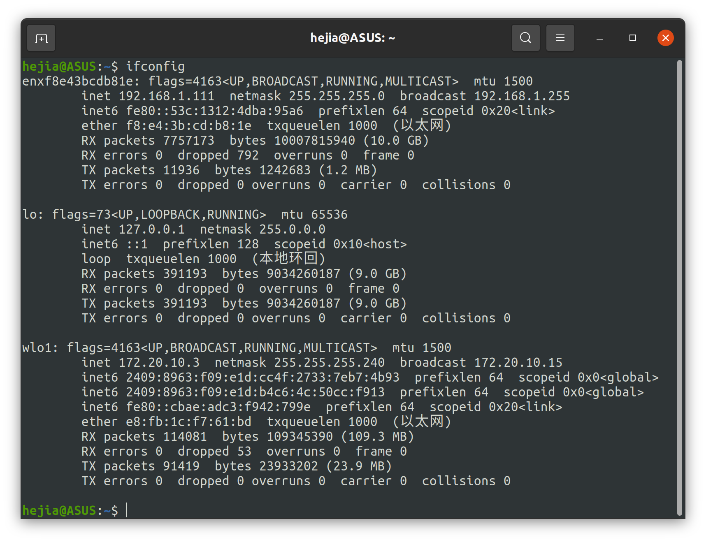
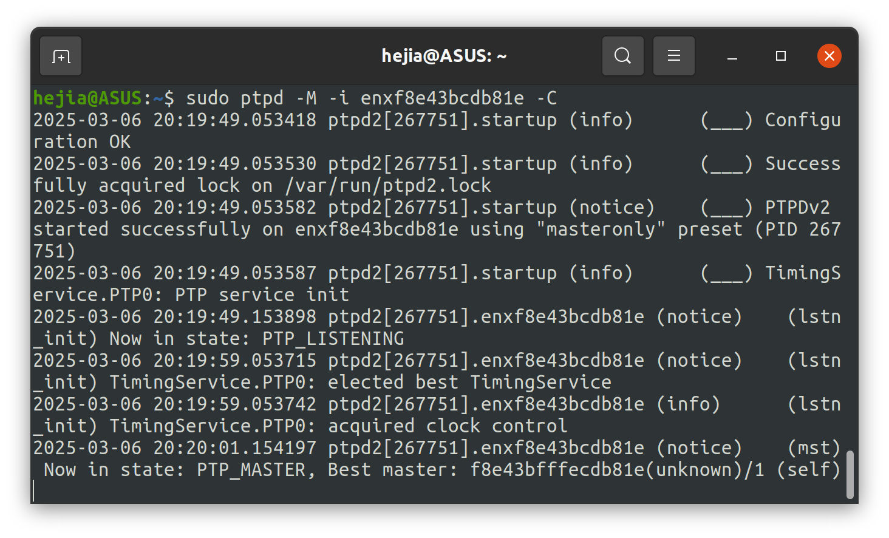
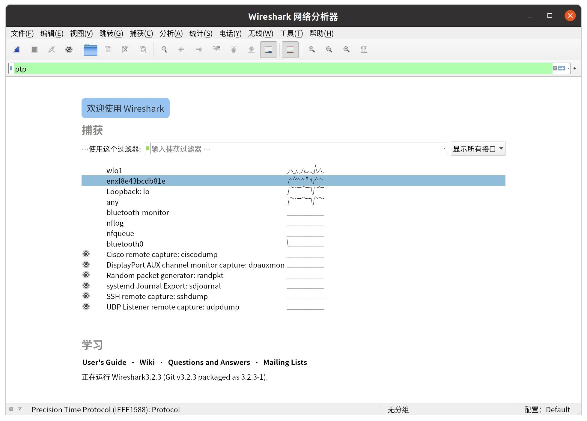
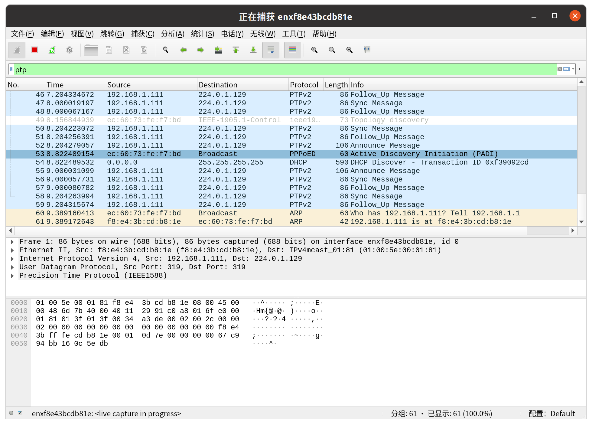
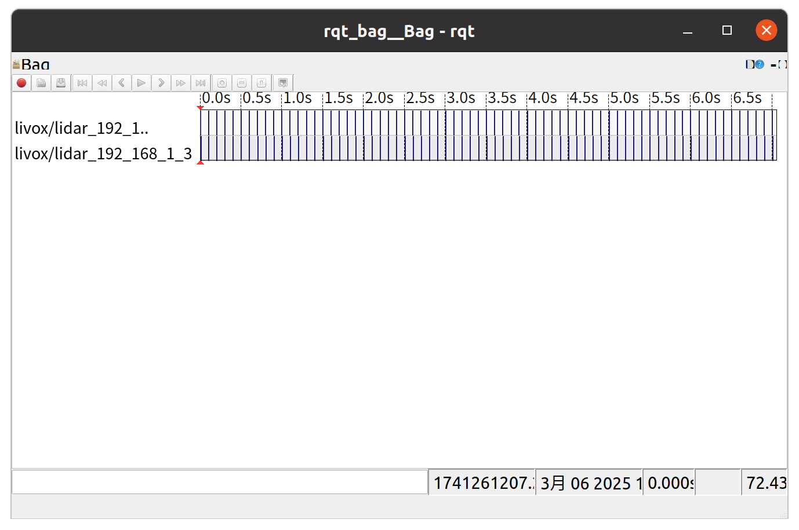

# 多Livox雷达时间硬同步

---

## 确认上位机 IP

`ifconfig `查看主机网口：



本机网口为 `enxf8e43bcdb81e`，也就是主机连接的路由器（交换机）的网口。

---

## 使用PTPD进行硬件时间同步

```
sudo apt install ptpd
```

```
sudo ptpd -M -i enxf8e43bcdb81e -C
```

出现best master的时候，即已发布硬同步消息：



但是有时候会因为上一个PTPD进程没有完全杀死出现报错，这时候执行以下命令并重新启动即可：

```
sudo rm /var/run/ptpd2.lock
```

---

## 使用wireshark测试同步功能（optional）

```
sudo wireshark
```



输入 `ptp`，并选择接口 `enxf8e43bcdb81e `



出现Sync Message信号，说明时钟功能正常运行。

---

## 启动livox激光雷达

启动已经配置了多激光雷达的launch文件，使用`rqt_bag`来查看同步情况：



至此两个激光雷达已完成硬同步。
